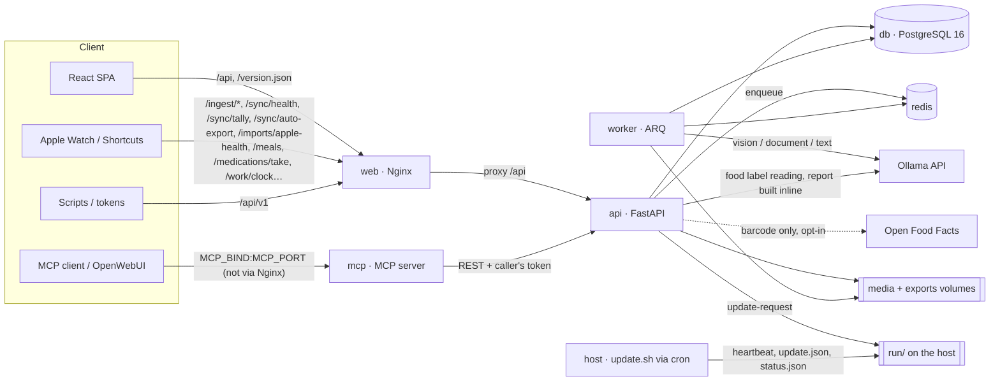
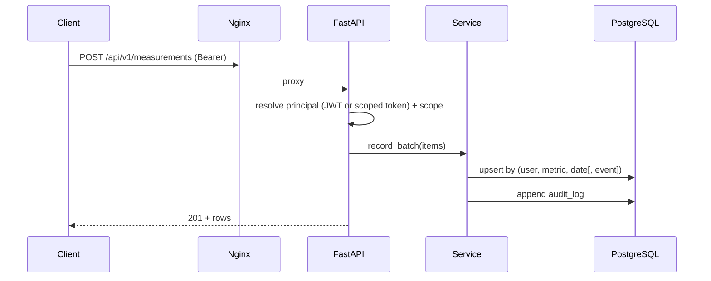
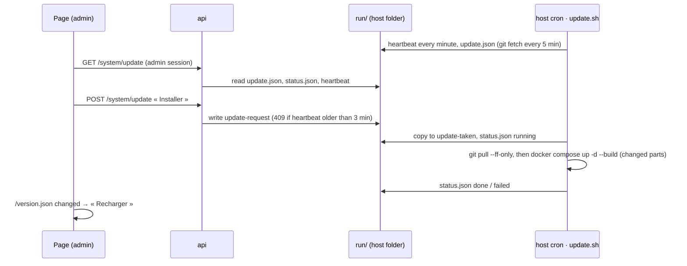

# Architecture

## Services

* **web** (Nginx) serves the React build and `/version.json` (one id per
  build) and reverse‑proxies `/api` — there is no `/mcp` location. It sets
  the strict CSP and other security headers, caps request bodies at 25 MB
  (no cap for `/api/v1/imports/apple-health` and `/api/v1/sync/auto-export`)
  and logs URLs with `token=***`.
* **api** (FastAPI, async) is the single source of truth. Every write is
  audited; all reads are isolated per `user_id`. It applies the migrations
  when it starts (`backend/entrypoint.sh`: `alembic upgrade head` unless
  `RUN_MIGRATIONS=false`). It also calls Ollama itself for a nutrition
  label read from a photo (Mes aliments, 100 s limit) and for a report
  built inline, and Open Food Facts when `FOOD_LOOKUP_ONLINE=true`.
* **worker** (ARQ, `RUN_MIGRATIONS=false`) runs the long jobs — see
  [Background jobs](#background-jobs).
* **mcp** exposes the hub's tools to an MCP client on its own port
  (`MCP_BIND:MCP_PORT`, container port 9000); it is a *client of the REST
  API* with each caller's own token, never a parallel path to the
  database.
* **db** (PostgreSQL 16) stores the fixed schema; JSONB holds dynamic
  options and raw payloads.
* **redis** is the worker's queue.

## Request flow (write)

## Access levels

`core/deps.py` resolves the caller (*principal*) from a session access JWT
or an API token (SHA‑256 lookup); each route then declares what it needs:

| Dependency | Accepts |
|------------|---------|
| `require_scope(s)` / `ReaderDep` (`read:all`) | a session, a `hub:full` token, or a token carrying the scope |
| `require_scope_flex(s)` (`core/deps_query.py`) | the same, plus an API token as `?token=` (iPhone Shortcuts) |
| `UserDep` | a session or a `hub:full` token |
| `InteractiveDep` | a session only: tokens, MFA, account deletion, Shortcut download |
| `AdminDep` (`core/deps_admin.py`) | an admin's session only: `/system/update` |
| `CatalogDep` | an admin (session, or token with `write:metrics` or `hub:full`): `POST /metrics`, `PATCH /metrics/{key}` |

Details and known limitations: [SECURITY.md](../SECURITY.md#access-levels).

## Background jobs

The API enqueues jobs in Redis (`workers/queue.py`, best effort: a failed
enqueue is logged, never raised); the worker (`workers/worker.py`) runs
them with `job_timeout = 7200` s and `max_tries = 1` (no automatic retry).

| Job | Enqueued by | Does |
|-----|-------------|------|
| `analyze_photo` | photo upload (`/ingest/photo`), re-analysis (`/photos/{id}/analyze`, `/evolution/reanalyze-all`) | EXIF-free normalised JPEG, quality check, vision model, comparison |
| `analyze_document` | medical document or lab PDF upload, « Analyser » | document model reads the values, checked against the text; text model summary (30 min limit per document) |
| `analyze_meal` | meal created, edited, photo added or removed | vision model on the photos, text model for foods, grams, Ciqual references and verdict, values computed by code (15 min limit) |
| `import_apple_health_job` | `POST /imports/apple-health` | imports the zip / XML, then enqueues `reconcile_data` |
| `reconcile_data` | Données › Réconcilier, and after **each** Apple import (`services/imports.py`) | merges duplicate keys, rebuilds daily values from raw samples, aligns the Apple catalogue |
| `generate_report` | `POST /reports` | builds the file, stores its SHA-256, audits it |
| `ping` | — | liveness |

At startup the worker re-queues the document and meal readings left
`queued` / `running` by a previous worker. When Redis is down, a report is
built **inline** in the `POST /reports` request (`api/v1/reports.py`); a
document or meal reading is left unqueued (status cleared) and can be asked
again. Ollama serves one request at a time (`core/ollama.py`).

## Update flow

No container mounts the Docker socket: the API only reads and writes files
in `run/` (mounted at `/data/update`); `update.sh` runs on the host with the
user's rights (`--cron`, `--install-cron`, `--auto`). The rebuilt `api`
applies the migrations as it starts; the seed (metric catalogue, admin
account) runs only from `install.sh`. Every page, admin or not, polls
`/version.json` and offers to reload after a new web build.

## Functional areas

* **Journal** — counters (`/sync/tally`: water, coffee, cigarettes; a tap
  adds to the day's value and is audited with its channel), timed pee
  entries, medication doses (`/medications/*`, adherence), meals
  (`/meals`: up to 7 photos in `media`, read by `analyze_meal`) and « Mes
  aliments » (`/foods`: values per 100 g, label read by the vision model,
  optional Open Food Facts lookup). The ANSES **Ciqual 2025** table ships
  in `backend/app/data/ciqual.tsv` (read offline, `services/ciqual.py`): a
  food with a Ciqual reference or a label always gets the same values.
  `/journal/days` gives one line per day.
* **Medical record** (Dossier, Suivi) — documents (encrypted files, read by
  `analyze_document`), lab values (`bio.*`), conditions, treatments,
  appointments, the Apple CDA document; `/medical/record` assembles the
  results, suggestions and chronology.
* **Work** (Travail) — work sessions (clock in / out, on site or remote),
  absences (half days, HR imports), evidence (proofs and traces, files
  encrypted with their SHA-256), nights; `/work/health` and the
  `work_health` report build the work ↔ health file.
* **Reports** — a `reports` row per request; the file is written to
  `EXPORTS_DIR/<user>/` (not encrypted). The clinical PDF and the
  synthesis add the period's facts (`services/report_facts.py`, also
  `GET /facts`: habits, adherence, meals, traceability, before / after);
  their header gives the version (`GIT_COMMIT`) and the SHA-256 of the
  data used, and every page's footer the report id, local time and zone.
  The file's SHA-256 is stored and audited; `POST /reports/verify` checks
  a copy. The clinical synthesis is written by the text model from the
  record's facts; a sentence without a cited fact, or with a number absent
  from its facts, is removed.

## Key design choices

* **Dynamic metric registry** + **polymorphic typed measurements** so a new
  field is a data insert, never a migration
  ([ADR‑0002](adr/0002-dynamic-metric-registry.md)).
* **Derived & rolling values are computed on read** (never stored twice) —
  see [`services/aggregation.py`](../backend/app/services/aggregation.py).
* **Refresh‑session table** for rotation + revocation
  ([ADR‑0003](adr/0003-refresh-sessions.md)).
* **Metadata‑driven initial migration** keeps Alembic in lock‑step with the
  ORM ([ADR‑0004](adr/0004-metadata-initial-migration.md)).

## Roadmap

Phases, per the specification (§18):

1. **Foundation & quality** — compose, auth, tokens, audit, CI. ✅
2. **Registry + measurements** — dynamic metrics, idempotent batch, seed. ✅
3. **Ingestion** — `/ingest/watch`, `/ingest/ppc`, capture (mode B). ✅
4. **Photos + AI** — ingest → normalize → Ollama analysis → comparison. ✅
5. **Dashboards** — per‑domain views with rolling averages. ✅
6. **Exports & reports** — CSV/JSON/XLSX, clinical PDF, FHIR. ✅
7. **MCP** — tools wired to the MCP hub. ✅
8. **Automations** — NFC/Shortcuts, capture rules, reminders. ✅
9. **Hardening & docs** — MFA, media encryption, RGPD erasure, SBOM+scans in CI. ✅
