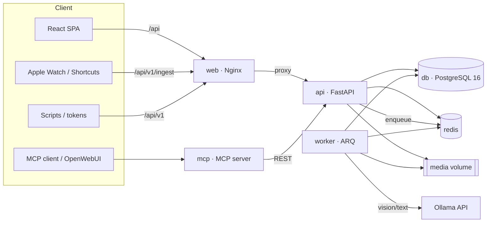
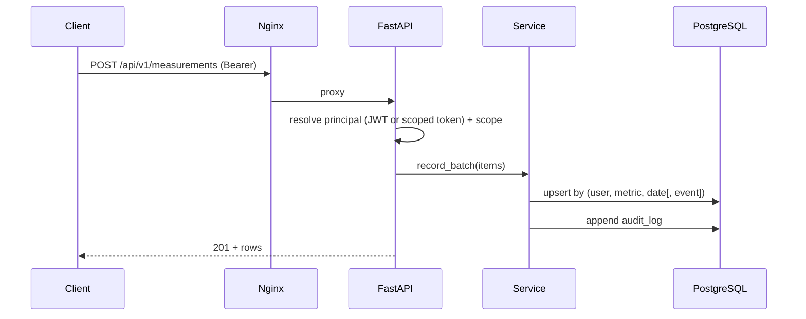

# Architecture

## Services

* **web** (Nginx) serves the React build and reverse‑proxies `/api` (and,
  when enabled, `/mcp`). It sets the strict CSP and other security headers.
* **api** (FastAPI, async) is the single source of truth. Every write is
  audited; all reads are isolated per `user_id`.
* **worker** (ARQ) runs async jobs (photo analysis, reports — Phase 4+).
* **mcp** exposes the hub's tools to an MCP client; it is a *client of the
  REST API*, never a parallel path to the database.
* **db** (PostgreSQL 16) stores the fixed schema; JSONB holds dynamic
  options and raw payloads.
* **redis** is the worker broker and cache.

## Request flow (write)

## Key design choices

* **Dynamic metric registry** + **polymorphic typed measurements** so a new
  field is a data insert, never a migration
  ([ADR‑0002](adr/0002-dynamic-metric-registry.md)).
* **Derived & rolling values are computed on read** (never stored twice) —
  see [`services/aggregation.py`](../backend/app/services/aggregation.py).
* **Refresh‑session table** for rotation + revocation
  ([ADR‑0003](adr/0003-refresh-sessions.md)).
* **Metadata‑driven initial migration** keeps Alembic in lock‑step with the
  ORM ([ADR‑0004](adr/0004-metadata-initial-migration.md)).

## Roadmap

Phases, per the specification (§18):

1. **Foundation & quality** — compose, auth, tokens, audit, CI. ✅
2. **Registry + measurements** — dynamic metrics, idempotent batch, seed. ✅
3. **Ingestion** — `/ingest/watch`, `/ingest/ppc`, capture (mode B). ✅
4. **Photos + AI** — ingest → normalize → Ollama analysis → comparison. ✅
5. **Dashboards** — per‑domain views with rolling averages. ✅
6. **Exports & reports** — CSV/JSON/XLSX, clinical PDF, FHIR. ✅
7. **MCP** — tools wired to the MCP hub. ✅
8. **Automations** — NFC/Shortcuts, capture rules, reminders. ✅
9. **Hardening & docs** — SBOM, scans, signed images, media encryption.
