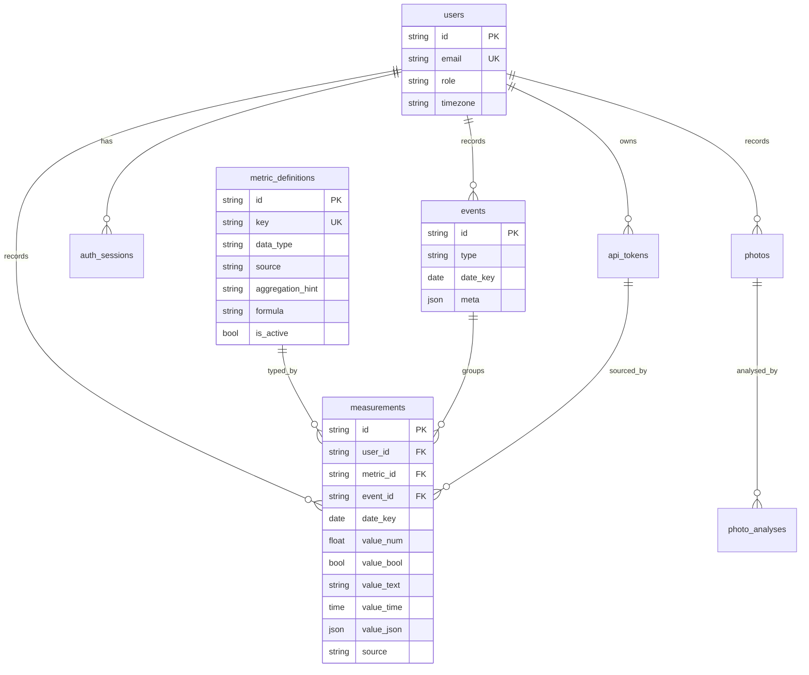

# Data model

The core is a **metric registry** plus a **polymorphic, typed measurement**
store. Adding a metric is an insert into `metric_definitions`; no migration.
Values live in typed columns (not free text) so they stay queryable and
aggregable. Derived and rolling values are **computed on read** (§5.3).

## Fixed tables

`users`, `api_tokens`, `auth_sessions`, `metric_definitions`, `events`,
`measurements`, `photos`, `photo_analyses`, `automations`, `reports`,
`audit_log`. Their columns follow the specification §5.2 (plus
`auth_sessions`, see [ADR‑0003](adr/0003-refresh-sessions.md)).

## Full-fidelity Apple Health tables

Added for the Apple Health import (see
[ADR‑0006](adr/0006-apple-health-import.md)). Unlike `measurements` (one
curated value per day), these keep **every** imported record:

- `health_samples` — every raw quantity/category sample (metric, exact
  `start_at`, value, unit, device); millions of rows, indexed
  `(user_id, metric_id, start_at)`.
- `workouts` — one row per session (type, duration, energy, distance).
- `ecg_records` — ECG metadata (classification, rate, sample count) with
  the voltage CSV stored encrypted on disk; poor-quality traces are
  skipped at import.
- `route_files` — GPS route metadata; the GPX stays on disk.
- `clinical_observations` / `clinical_documents` — observations parsed
  from the CDA document, plus the stored raw `export_cda.xml`.
- `import_jobs` — background import status and progress.

These are additive (migrations `0004`, `0005`); the daily roll-ups written
into `measurements` remain the dashboards' plottable cache.

## Idempotency (zero redundancy)

A measurement is unique per `(user_id, metric_id, date_key, event_id)`.
Two partial unique indexes enforce it (one for daily entries where
`event_id IS NULL`, one for event‑scoped rows). Writes **upsert**: recording
the same metric for the same day updates the row instead of duplicating it.

## Value routing

| `data_type` | Stored in |
|-------------|-----------|
| `int`, `float`, `duration`, `score` | `value_num` |
| `bool` | `value_bool` |
| `time` | `value_time` |
| `text`, `enum` | `value_text` |
| (object) | `value_json` |

See [`services/measurement_values.py`](../backend/app/services/measurement_values.py).

## Derived metrics

Metrics with `source = "derived"` carry a `formula` and are **read‑only**
through the write API. Examples from the catalogue: `hydration.liters =
water.bottles_1_5 * 1.5`, `workout.recovery_delta = workout.hr_max -
workout.hr_recovery_1min`.
