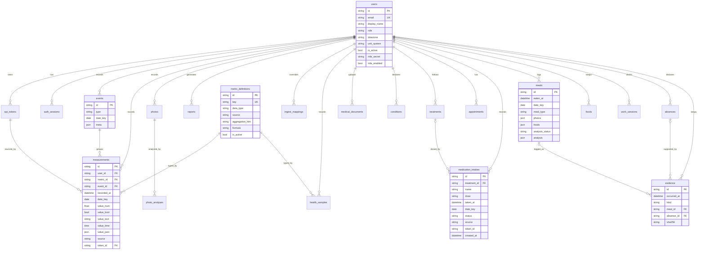

# Data model

The core is a **metric registry** plus a **polymorphic, typed measurement**
store. Adding a metric is an insert into `metric_definitions`; no migration.
Values live in typed columns (not free text) so they stay queryable and
aggregable. Derived and rolling values are **computed on read** (§5.3).

`meals.foods` points at `foods` rows by id inside a JSON list (no foreign
key): deleting a food leaves the meals already read as they are.

## Fixed tables

Baseline (migration `0001`): `users`, `api_tokens`, `auth_sessions`,
`metric_definitions`, `events`, `measurements`, `photos`,
`photo_analyses`, `automations`, `reports`, `audit_log`. Their columns
follow the specification §5.2 (plus `auth_sessions`, see
[ADR‑0003](adr/0003-refresh-sessions.md)), with these worth knowing:

- `users` — `email` (unique), `display_name`, `password_hash`, `role`
  (`admin` — the hub's administrator: updates, shared metric catalogue —
  or `user`), `timezone` (`Europe/Paris` by default: every local day is
  computed in it), `unit_system` (`metric`), `is_active` (an inactive
  account can neither log in nor use its tokens), `mfa_secret` /
  `mfa_enabled` (optional TOTP, migration `0003`).
- `measurements` — besides the typed value columns: `recorded_at` (the
  time sent with the value, else when it was written), `date_key` (the
  day it belongs to), `source` (who wrote it: `manual`, `watch`, `work`…)
  and `token_id` (the API token it came through, `NULL` for the web
  session; set to `NULL` if the token is deleted).
- `reports` — `type`, `period_start` / `period_end`, `params`, `status`,
  `file_path`; `summary` (JSON: the AI clinical synthesis — sections,
  facts, rejected sentences; migration `0009`) and `sha256` (hash of the
  generated file, indexed: `POST /reports/verify` finds a copy by it;
  reports made before migration `0020` have none).

Added by later migrations (each creates only its own tables, ADR‑0004):

- `ingest_mappings` (`0002`) — external key → metric key per source
  (`watch`, `ppc`); `user_id NULL` is a global default, a user row
  overrides it.
- `medical_documents` (`0006`) — `kind`, `title`, `doc_date`,
  `file_path` (the file on disk, encrypted at rest when encryption is
  on), `media_type`, `size_bytes`, `notes`; `analysis_status` (`NULL`
  never read, `queued`, `running`, `done`, `failed`) and `analysis`
  (JSON: summary, medications and diagnoses read, the grounded values,
  rejected proposals with their reason, models used, error), migration
  `0008`.
- `conditions` (`0007`) — `name`, `code`, `status` (`active`,
  `resolved`, `suspected`), `onset_date`, `notes`.
- `treatments` (`0007`) — `name`, `dose`, `frequency`, `doses_per_day`
  (planned doses a day, the adherence denominator; `NULL` = as needed;
  migration `0019`), `start_date`, `end_date`, `active`, `notes`.
- `appointments` (`0007`) — `title`, `starts_at`, `ends_at`,
  `practitioner`, `location`, `notes`, `source` (`manual` or `ics`),
  `external_uid` (the `.ics` event, so a re-import does not duplicate).
- `meals` (`0010`) — `eaten_at`, `date_key`, `meal_type` (`breakfast`,
  `lunch`, `snack`, `dinner`), `description`; `price` and `vendor`
  (`0013`: filled when the meal is logged from a paid trace — a
  delivery, a receipt —; a meal logged in the Journal has none);
  `photo_path` (the plate), `photos` (`0017`: up to 6 more,
  `[{"id", "path"}]` — the pack, its nutrition label), `foods` (`0017`:
  `[{"food_id", "grams"}]`, grams `NULL` = estimated or the whole
  package); `analysis_status` (`NULL`, `queued`, `running`, `done`,
  `failed`) and `analysis` (JSON: items with their grams and origin,
  checked nutrients, score and verdict).
- `foods` (`0017`, `0018`, `0021`) — a user's food sheet: `name`,
  `brand`, `aliases` (other names used in a meal, comma-separated),
  `package_g` (box / sachet weight), `unit_name` / `unit_g` (« tomate »
  = 120 g: « 2 tomates » in a meal is 240 g), `portion_g` (`0021`: what
  the user usually eats of it — the whole small box, ¼ of the big one —
  counted when a meal gives no quantity; one sheet per size), `per_100g`
  (JSON: `energy_kcal`, `protein_g`, `carbs_g`, `sugars_g`, `fat_g`,
  `sat_fat_g`, `fiber_g`, `sodium_mg`), `note`, `source` (where the
  values come from: « étiquette », « Ciqual 2025 · code · name », « Open
  Food Facts · barcode », « saisie »), `barcode`, `photos` (`[{"id",
  "kind": "pack" | "label", "path"}]`).
- `food_stock_moves` (`0022`) — a food's stock entries: `food_id`
  (`CASCADE` with the food), `at`, `kind` (`purchase` +, `out` −,
  `count`: the quantity left at that time), `grams`, `said` (« 3 × 185
  g »), `note`, `source` (web, mcp, raccourci). What meals ate is **not**
  stored: it is read from their analysis (lines of the food, source
  « étiquette »; meals with a price excluded), after the last `count`,
  else after the food's first move.
- `medication_intakes` (`0019`) — one row per dose: `treatment_id` (`SET
  NULL` when the treatment is deleted), `name` and `dose` **copied** from
  the treatment at the time (the history survives its deletion),
  `taken_at` (when taken), `date_key` (its local day), `status`
  (`taken`, or `skipped`: declared not taken), `source` (how it was
  entered: `web` for the web session, `mcp` for a `hub:full` token,
  `raccourci` for any other token — an iPhone Shortcut), `token_id` (that
  token, plain id), `note`; `created_at` is **when it was entered**, so a
  dose typed days later shows as such.
- `work_sessions` (`0011`, `0012`, `0015`) — `start_at` (`NULL`: clock-in
  missing), `end_at` (`NULL`: at work, or clock-out missing), `source`
  (`tap` — one-tap / GPS Shortcut —, `manual` — web, assistant —,
  `import`, or `edited` — times completed or fixed by hand), `note`,
  `place` (`site` or `remote`); unique `(user_id, start_at)`.
- `absences` (`0012`, `0016`) — `start_date`, `end_date`, `kind`
  (`arret_maladie`, `accident_travail`, `maladie_pro`, `conge`, `repos` —
  RTT, time off in lieu —, `autre`), `cause`, `note`, `start_half` (`am`,
  or `pm`: from the afternoon of the first day) and `end_half` (`pm`, or
  `am`: until noon of the last day) — a half day counts ½.
- `evidence` (`0012`, `0013`, `0014`) — proofs and traces:
  `occurred_at`, `time_known` (false when only the day is known, e.g. an
  expense line, until a receipt of the same day and amount gives the
  time), `ended_at` (parking exit, taxi drop-off, hotel check-out),
  `kind` (proofs `appel`, `sms`, `mail`, `capture`, `note`, `document`,
  `autre`; traces `transport`, `taxi`, `parking`, `livraison`, `repas`,
  `hotel`, `frais`, `activite` — see `services/evidence.py`), `place`,
  `amount`, `currency` (`EUR`), `meal_id` (the meal a delivered or bought
  meal was logged as), `title`, `description`, `count` (how many events
  it stands for: 12 calls on one screenshot), `file_path`, `file_name`,
  `media_type`, `size_bytes`, `sha256` (of the file as received),
  `absence_id` (the absence it supports; `SET NULL` on delete).

## Full-fidelity Apple Health tables

Added for the Apple Health import (see
[ADR‑0006](adr/0006-apple-health-import.md)). Unlike `measurements` (one
curated value per day), these keep **every** imported record:

- `health_samples` — every raw quantity/category sample (metric, exact
  `start_at`, value, unit, device); millions of rows, indexed
  `(user_id, metric_id, start_at)`.
- `workouts` — one row per session (type, duration, energy, distance).
- `ecg_records` — ECG metadata (classification, rate, sample count) with
  the voltage CSV stored encrypted on disk; poor-quality traces are
  skipped at import.
- `route_files` — GPS route metadata; the GPX stays on disk.
- `clinical_observations` / `clinical_documents` — observations parsed
  from the CDA document, plus the stored raw `export_cda.xml`.
- `import_jobs` — background import status and progress.

These are additive (migrations `0004`, `0005`); the daily roll-ups written
into `measurements` remain the dashboards' plottable cache.

`health_samples` is not only Apple's: every timed entry lives there, told
apart by `source` and `device`:

| What | `source` | `device` | Written by |
|------|----------|----------|------------|
| Native export and SimpleHealthExportCSV zip | `apple` | the recording device | `services/apple_health/importer.py` |
| Health Auto Export push | `auto-export` | `Health Auto Export` | `services/auto_export.py` |
| A pee (Journal, `/sync/tally`, `/journal/urination`) — metric `elimination.urination`, value 1 | `manual` | `journal` | `services/urination.py` |
| A night typed by hand (bedtime → wake-up, `value_text` `asleep`, awakenings in `value_num`) | `manual` | `Saisie manuelle` | `services/sleep_manual.py` |
| A meal's nutrients, one sample per nutrient at the meal's time, in Apple's nutrition metrics | `meal` | `meal:<meal id>` | `services/meal_nutrients.py` |

Only `apple` rows are touched by « Supprimer les données importées »
(`POST /imports/reset`) and by a re-import. Re-pushing a day with Health
Auto Export replaces that day's `auto-export` rows; re-reading, editing or
deleting a meal replaces or removes exactly its `meal:<id>` rows.

## Idempotency (zero redundancy)

A measurement is unique per `(user_id, metric_id, date_key, event_id)`.
Two partial unique indexes enforce it (one for daily entries where
`event_id IS NULL`, one for event‑scoped rows). Writes **upsert**: recording
the same metric for the same day updates the row instead of duplicating it.

## Value routing

| `data_type` | Stored in |
|-------------|-----------|
| `int`, `float`, `duration`, `score` | `value_num` |
| `bool` | `value_bool` |
| `time` | `value_time` |
| `text`, `enum` | `value_text` |
| (object) | `value_json` |

See [`services/measurement_values.py`](../backend/app/services/measurement_values.py).

## Derived metrics

Metrics with `source = "derived"` carry a `formula` and are **read‑only**
through the write API. Examples from the catalogue: `hydration.liters =
water.bottles_1_5 * 1.5`, `workout.recovery_delta = workout.hr_max -
workout.hr_recovery_1min`.

## Daily values rebuilt from raw rows

Some daily values in `measurements` are not typed: they are rebuilt from
their raw rows each time those change, so there is one truth.

- **Work** (`services/work_days.py`, `source = "work"`): from
  `work_sessions`, per local day (a session belongs to the day it
  starts) — `work.hours` (hours of closed sessions, remote included),
  `work.remote_hours` (the part worked remote), `work.start` (first
  clock-in) and `work.end` (last clock-out), both in decimal hours of the
  day (8.25 = 08:15; past midnight 25.5 = 01:30 the next day). Adding,
  editing, merging or deleting a session rebuilds its days; a day without
  sessions is cleared.
- **Pees** (`elimination.urination`) and **meal nutrients**: the day's
  value is rebuilt from the `health_samples` rows above (count of pees,
  sum of nutrients) — `services/timed_entries.py`.
- **A typed night** also sets that day's `sleep.asleep` (`source =
  "manual"`); deleting the night removes it.

## Reference data

`backend/app/data/ciqual.tsv` — an extract of the ANSES **Ciqual 2025**
food composition table (3,484 foods: code, name, sub-group and per 100 g
energy, proteins, carbohydrates, sugars, fat, saturated fat, fibre,
sodium; licence Etalab 2.0). It is shipped in the image and read offline
by `services/ciqual.py` (nothing is downloaded or sent at run time); a
meal's Ciqual references and the food sheet search (`GET /ciqual`) use
it. Source, checksum and how to regenerate it:
[`backend/app/data/README.md`](../backend/app/data/README.md). It is not
a database table.

## Migrations

`backend/alembic/versions`, one chain; each migration creates only its
own tables from the ORM metadata, and column additions are guarded so a
fresh database built from the live models is left untouched (ADR‑0004).

| Revision | What it does |
|----------|--------------|
| `0001_initial` | Baseline tables (list above), with the partial unique indexes of `measurements`. |
| `0002_ingest_mappings` | `ingest_mappings`. |
| `0003_user_mfa` | `users.mfa_secret`, `users.mfa_enabled` (optional TOTP). |
| `0004_raw_health_data` | Full-fidelity Apple tables: `health_samples`, `workouts`, `ecg_records`, `route_files`, `import_jobs`. |
| `0005_clinical_cda` | `clinical_observations`, `clinical_documents`. |
| `0006_medical_documents` | `medical_documents`. |
| `0007_care` | `conditions`, `treatments`, `appointments`. |
| `0008_document_analysis` | `medical_documents.analysis_status`, `analysis`. |
| `0009_report_summary` | `reports.summary` (AI clinical synthesis). |
| `0010_meals` | `meals`. |
| `0011_work_sessions` | `work_sessions` (clock-in / clock-out). |
| `0012_work_file` | `work_sessions.start_at` nullable (clock-in missing); `absences`, `evidence`. |
| `0013_traces` | `evidence.ended_at`, `place`, `amount`, `currency`, `meal_id`; `meals.price`, `vendor`. |
| `0014_trace_time_known` | `evidence.time_known`. |
| `0015_work_place` | `work_sessions.place` (`site` / `remote`). |
| `0016_absence_halves` | `absences.start_half`, `end_half`. |
| `0017_foods` | `foods`; `meals.photos`, `meals.foods`. |
| `0018_food_units` | `foods.unit_name`, `unit_g`, `source`, `barcode`. |
| `0019_medication_intakes` | `medication_intakes`; `treatments.doses_per_day`. |
| `0020_report_hash` | `reports.sha256`. |
| `0021_food_portion` | `foods.portion_g`. |
| `0022_food_stock` | `food_stock_moves`. |
